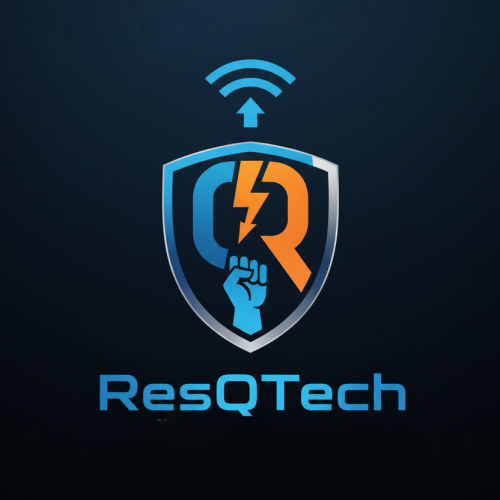

# ResQTech Emergency Notification System

<div align="center">



**ระบบแจ้งเตือนฉุกเฉินอัจฉริยะ ผ่าน ESP32 + LINE Messaging API**

[](https://php.net)
[](LICENSE)
[](https://www.espressif.com/)

</div>

---

## ✨ Features

| Feature | Description |
|---------|-------------|
| 🔔 **Real-time Alerts** | ส่งการแจ้งเตือนฉุกเฉินผ่าน LINE ทันทีเมื่อกดปุ่ม |
| 📡 **ESP32 Integration** | รองรับการเชื่อมต่อกับ ESP32 ผ่าน WiFi |
| 💓 **Heartbeat Monitoring** | ตรวจสอบสถานะอุปกรณ์แบบ Real-time |
| �️ **Web Dashboard** | หน้าจอควบคุมแบบ Neo-Brutalism Design |
| 📱 **Flutter Mobile App** | แอพมือถือสำหรับ iOS/Android |
| 🌐 **Multi-language** | รองรับภาษาไทยและอังกฤษ |
| 🌙 **Dark/Light Theme** | สลับธีมได้ตามต้องการ |
| 🔐 **Google OAuth** | เข้าสู่ระบบด้วย Google Account |

---

## 🌐 Multi-language (TH/EN)

- รองรับสลับภาษาไทย/อังกฤษผ่านปุ่มภาษา (EN/TH) บนหัวเว็บ
- ครอบคลุมข้อความทั้งฝั่ง PHP และข้อความที่แสดงด้วย JavaScript (เช่น LIVE/ERROR, Loading/No data, CONNECTED/DISCONNECTED, ONLINE/OFFLINE)

---

## 📁 Project Structure

```
ResQtechApp/
├── 📂 api/                         # API Endpoints
│   ├── check-status.php            # ตรวจสอบสถานะ ESP32
│   ├── esp32-receiver.php          # รับสัญญาณจาก ESP32
│   ├── get-history.php             # ดึงประวัติเหตุการณ์
│   ├── mobile-login.php            # API สำหรับ Mobile App
│   ├── send-notification.php       # ส่งการแจ้งเตือนแบบ Manual
│   └── stream.php                  # SSE Real-time Updates
│
├── 📂 assets/
│   ├── css/
│   │   ├── neo-brutalism.css       # Design System หลัก
│   │   └── monitoring-ui.css       # Dashboard Styles
│   └── js/
│       ├── app.js                  # Main Application Logic
│       ├── dashboard.js            # Dashboard Charts
│       └── theme.js                # Theme Management
│
├── 📂 config/
│   └── config.php                  # Configuration (loads .env)
│
├── 📂 firmware/
│   └── esp32_resqtech.ino          # Arduino Code สำหรับ ESP32
│
├── 📂 includes/
│   ├── auth.php                    # Authentication Functions
│   ├── functions.php               # Core Utility Functions
│   ├── google-oauth.php            # Google OAuth Integration
│   ├── init.php                    # Application Bootstrap
│   ├── lang.php                    # Multi-language System
│   └── navigation.php              # Reusable Navigation Component
│
├── 📂 mobile_app/                  # Flutter Mobile Application
│
├── 📂 logs/                        # Log Files (auto-created)
│
├── 📄 index.php                    # หน้าหลัก (Home)
├── 📄 dashboard.php                # แดชบอร์ดสถิติ
├── 📄 control-room.php             # ห้องควบคุม War Room
├── 📄 status-dashboard.php         # สถานะอุปกรณ์
├── 📄 history-dashboard.php        # ประวัติเหตุการณ์
├── 📄 live-dashboard.php           # Live Feed (SSE)
├── 📄 perf-dashboard.php           # Latency Monitor
├── 📄 diagnostics-dashboard.php    # System Diagnostics
├── 📄 login.php                    # หน้า Login
└── 📄 logout.php                   # Logout Handler
```

---

## 🚀 Quick Start

### 1. Clone Repository

```bash
git clone https://github.com/StangITC/ResQtech.git
cd ResQtech
```

### 2. Setup Environment

```bash
# Copy example environment file
cp .env.example .env

# Edit .env with your credentials
nano .env
```

### 3. Configure `.env`

```env
# Admin Credentials
ADMIN_USERNAME=admin
ADMIN_PASSWORD_HASH=<use tools/generate-password.php>

# LINE Official Account
LINE_CHANNEL_ACCESS_TOKEN=your_line_token
LINE_USER_ID=your_line_user_id

# ESP32 Integration
ESP32_API_KEY=your_secret_key

# Google OAuth (Optional)
GOOGLE_CLIENT_ID=your_client_id
GOOGLE_CLIENT_SECRET=your_client_secret
GOOGLE_REDIRECT_URI=http://your-domain/google-callback.php
```

### 4. Setup Web Server

- **Apache**: ตรวจสอบว่า `mod_rewrite` เปิดใช้งาน
- **Permissions**: ให้สิทธิ์เขียน `logs/` directory

```bash
chmod 755 logs/
```

### 5. Flash ESP32

1. เปิดไฟล์ `firmware/esp32_resqtech.ino` ใน Arduino IDE
2. แก้ไข WiFi และ API Settings:
   ```cpp
   const char* WIFI_SSID = "YOUR_WIFI_SSID";
   const char* WIFI_PASS = "YOUR_WIFI_PASSWORD";
   const char* SERVER_URL = "http://YOUR_SERVER_IP/ResQtechApp/api/esp32-receiver.php";
   const char* API_KEY = "YOUR_ESP32_API_KEY"; // ตรงกับ .env
   ```
3. Flash ลงบอร์ด ESP32

---

## 📡 ESP32 API Reference

### Heartbeat (ส่งทุก 10 วินาที)

```http
POST /api/esp32-receiver.php
Content-Type: application/json

{
  "key": "YOUR_API_KEY",
  "action": "heartbeat",
  "device_id": "ESP32-001",
  "location": "Main Entrance"
}
```

**Response:**
```json
{
  "status": "success",
  "message": "Heartbeat received",
  "timestamp": "2026-01-16 23:30:00",
  "server_total_ms": 5
}
```

### Emergency Alert (เมื่อกดปุ่ม)

```http
POST /api/esp32-receiver.php
Content-Type: application/json

{
  "key": "YOUR_API_KEY",
  "action": "emergency",
  "device_id": "ESP32-001",
  "location": "Main Entrance"
}
```

**Response:**
```json
{
  "status": "success",
  "message": "Emergency alert sent via LINE",
  "line_sent": true,
  "server_total_ms": 250,
  "line_api_ms": 180
}
```

---

## 🔐 Security Features

| Feature | Implementation |
|---------|----------------|
| 🔑 **Password Hashing** | Bcrypt (PASSWORD_DEFAULT) |
| 🛡️ **CSRF Protection** | Token-based validation |
| 🚫 **Brute Force Protection** | Rate limiting + lockout |
| 🔒 **Session Security** | Regeneration, timeout, fingerprint |
| 📋 **Security Headers** | CSP, X-Frame-Options, XSS Protection |
| 🧹 **Input Sanitization** | htmlspecialchars, strip_tags |
| ⏱️ **Rate Limiting** | Per-IP request throttling |
| 🔑 **API Key Validation** | Timing-safe comparison |

---

## 🎨 UI/UX Design

- **Design System**: Neo-Brutalism
- **Typography**: Inter, Space Grotesk, JetBrains Mono, Noto Sans Thai
- **Color Palette**: Vibrant colors with dark mode support
- **Theme Toggle**: โหลดสคริปต์ธีมแบบ `defer` ใน `<head>` เพื่อให้ปุ่มสลับธีมกดครั้งเดียวติด
- **Navigation**: Compact header with responsive design
- **Animations**: Smooth transitions and micro-interactions

---

## 📱 Mobile App (Flutter)

```bash
cd mobile_app
flutter pub get
flutter run
```

**Features:**
- Real-time status monitoring
- Push notifications
- Google Sign-In
- Dark/Light theme

### Build APK (Android)

```bash
cd mobile_app
flutter pub get

# แบบไฟล์เดียว
flutter build apk --release

# (แนะนำ) แยกตาม ABI เพื่อลดขนาดไฟล์
flutter build apk --release --split-per-abi
```

ไฟล์ APK จะอยู่ที่ `mobile_app/build/app/outputs/flutter-apk/`

---

## 🧩 Troubleshooting: เด้งหลุด Login / เข้า History แล้วเด้ง (401)

อาการ:
- Mobile App กดไปหน้า History/Status แล้ว “เด้งกลับหน้า Login” หรือเหมือนหลุดระบบ

สาเหตุที่พบบ่อย:
- API ตอบ `401 Unauthorized` เพราะฝั่ง PHP ไม่เห็น `Authorization: Bearer <session_id>` ในบางสภาพแวดล้อม (Apache/FastCGI บางแบบไม่ส่งผ่าน header นี้ให้ PHP อัตโนมัติ) ทำให้ `initSession()` ไม่ผูก session ตาม Bearer → `isLoggedIn()` เป็น `false` → แอปทำ `logout()` เมื่อเจอ 401

แนวทางแก้ที่ใช้ในโปรเจกต์นี้:
- ทำให้ PHP อ่าน Authorization ได้เสถียรขึ้น
  - เพิ่มกติกา passthrough Authorization ใน [.htaccess](./.htaccess) และ [api/.htaccess](./api/.htaccess)
  - เพิ่ม fallback อ่าน header จาก `getallheaders()` ใน [includes/auth.php](./includes/auth.php)
  - อัปเดต `last_activity` เมื่อ request มากับ Bearer (ลดโอกาสโดน timeout/หมดอายุเร็วผิดปกติ)
- ทำให้ Flutter ส่งข้อมูลยืนยันตัวตนครบขึ้น + จัดการ 401 ให้เรียบร้อย
  - แนบ `Cookie` เป็น fallback คู่กับ Bearer (เฉพาะ mobile/IO) และ `await logout()` เมื่อเจอ 401 ใน [api_service.dart](./mobile_app/lib/services/api_service.dart)

เช็กลิสต์หลังย้ายเครื่อง/Deploy:
- รีสตาร์ท Apache/Laragon หลังแก้ `.htaccess`
- ทดสอบ `mobile-login.php` ได้ session_id และเรียก `get-history.php` ได้ HTTP 200 (ไม่ใช่ 401)
- ถ้าเป็น Flutter Web: ตรวจ `CORS + Access-Control-Allow-Credentials` และให้ origin ตรงกับ whitelist ใน API

---

## 🔧 Tools

### Generate Password Hash

```bash
php tools/generate-password.php
```

หรือใช้ PHP:

```php
<?php
echo password_hash('your_password', PASSWORD_DEFAULT);
```

---

## 📊 Dashboard Pages

| Page | URL | Description |
|------|-----|-------------|
| 🏠 Home | `/index.php` | หน้าหลัก + Quick Actions |
| 📊 Dashboard | `/dashboard.php` | สถิติและภาพรวม |
| 🖥️ Control Room | `/control-room.php` | ห้องควบคุม War Room |
| 📡 Device Status | `/status-dashboard.php` | สถานะอุปกรณ์ทั้งหมด |
| 🧾 History | `/history-dashboard.php` | ประวัติเหตุการณ์ |
| 🔴 Live Feed | `/live-dashboard.php` | Real-time SSE Stream |
| ⏱️ Latency | `/perf-dashboard.php` | Performance Monitor |
| 🧪 Diagnostics | `/diagnostics-dashboard.php` | System Health Check |

---

## 🤝 Contributing

1. Fork the repository
2. Create feature branch (`git checkout -b feature/amazing-feature`)
3. Commit changes (`git commit -m 'Add amazing feature'`)
4. Push to branch (`git push origin feature/amazing-feature`)
5. Open a Pull Request

---

## 📝 License

This project is licensed under the MIT License - see the [LICENSE](LICENSE) file for details.

---

## 👥 Authors

- **StangITC** - *Initial work* - [GitHub](https://github.com/StangITC)

---

<div align="center">

**Made with ❤️ for Emergency Response**

</div>
