# 🚀 ResQTech — Tech Stack & System Architecture

> **ระบบแจ้งเตือนฉุกเฉินอัจฉริยะ ผ่าน ESP32 + LINE Messaging API**
> Repository: [StangITC/ResQtech](https://github.com/StangITC/ResQtech)

---

## 📌 ภาพรวมระบบ (System Overview)

ResQTech เป็นระบบ **IoT Emergency Notification** ที่ออกแบบมาเพื่อให้กดปุ่มฉุกเฉินบนอุปกรณ์ ESP32 แล้วแจ้งเตือนไปยังผู้ดูแลผ่านหลายช่องทาง (LINE, Push Notification, Web Dashboard) ได้ภายใน **ไม่กี่วินาที**

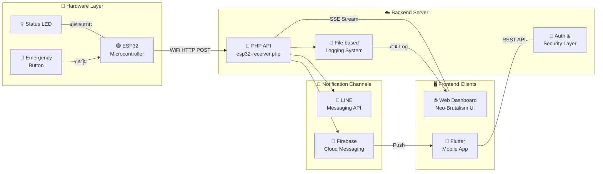

---

## 🧱 Tech Stack (เทคโนโลยีทั้งหมดที่ใช้)

### แบ่งตาม Layer

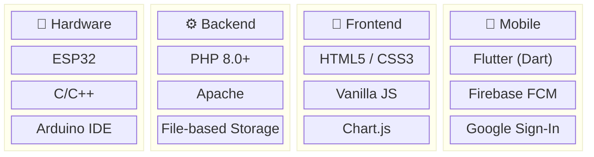

### ตารางสรุป Tech Stack

| Layer | Technology | Version / Note | หน้าที่ |
|-------|-----------|---------------|--------|
| **Hardware** | ESP32 (Espressif) | DevKit v1 | ไมโครคอนโทรลเลอร์หลัก รองรับ WiFi ในตัว |
| **Hardware** | Arduino Framework | C/C++ | เขียน Firmware ควบคุมปุ่ม/LED/ส่งข้อมูล |
| **Backend** | PHP | 8.0+ | ภาษาหลักฝั่ง Server ประมวลผล Request |
| **Backend** | Apache | + mod_rewrite | Web Server ให้บริการ HTTP |
| **Backend** | Laragon | Local Dev | จำลอง Server สำหรับพัฒนาบน Windows |
| **Backend** | File-based Storage | `.log` / `.jsonl` | เก็บข้อมูลแทน Database เพื่อ Latency ต่ำ |
| **Frontend** | HTML5 + CSS3 | Vanilla | โครงสร้างและสไตล์หน้าเว็บ |
| **Frontend** | JavaScript | Vanilla (No Framework) | Logic ฝั่ง Client, Charts, SSE |
| **Frontend** | Chart.js | via CDN | วาดกราฟสถิติบน Dashboard |
| **Frontend** | PWA | Service Worker | ติดตั้งเว็บเป็น App ได้ |
| **Mobile** | Flutter | Dart | สร้าง App iOS/Android จาก Codebase เดียว |
| **Mobile** | Firebase FCM | v1 API | Push Notification แจ้งเตือนเด้งมือถือ |
| **Integration** | LINE Messaging API | Push Message | ส่งข้อความแจ้งเตือนเข้า LINE |
| **Integration** | Google OAuth 2.0 | OpenID Connect | Login ด้วย Google Account |
| **Design** | Neo-Brutalism | Custom CSS | ดีไซน์ระบบขอบหนา สีเจ็บ ใช้ดูง่าย |
| **Typography** | Inter, Space Grotesk, JetBrains Mono, Noto Sans Thai | Google Fonts | ฟอนต์ที่ใช้ทั้งภาษาไทยและอังกฤษ |

---

## 📂 โครงสร้างโปรเจกต์ (Project Structure)

```mermaid
graph TD
    ROOT["📁 ResQtechApp/"]

    ROOT --> API_DIR["📂 api/<br/><i>API Endpoints ทั้งหมด</i>"]
    ROOT --> ASSETS["📂 assets/<br/><i>CSS, JS</i>"]
    ROOT --> CONFIG["📂 config/<br/><i>config.php + .env loader</i>"]
    ROOT --> FIRMWARE["📂 firmware/<br/><i>ESP32 Arduino Code</i>"]
    ROOT --> INCLUDES["📂 includes/<br/><i>Core PHP Functions</i>"]
    ROOT --> MOBILE["📂 mobile_app/<br/><i>Flutter App</i>"]
    ROOT --> LOGS["📂 logs/<br/><i>Log Files (auto-created)</i>"]
    ROOT --> PAGES["📄 PHP Pages<br/><i>dashboard, login, etc.</i>"]

    API_DIR --> A1["esp32-receiver.php"]
    API_DIR --> A2["stream.php (SSE)"]
    API_DIR --> A3["check-status.php"]
    API_DIR --> A4["get-history.php"]
    API_DIR --> A5["mobile-login.php"]
    API_DIR --> A6["send-notification.php"]
    API_DIR --> A7["perf-report.php"]
    API_DIR --> A8["register-fcm-token.php"]

    INCLUDES --> I1["init.php (Bootstrap)"]
    INCLUDES --> I2["functions.php (Core)"]
    INCLUDES --> I3["auth.php"]
    INCLUDES --> I4["lang.php (i18n)"]
    INCLUDES --> I5["google-oauth.php"]
    INCLUDES --> I6["navigation.php"]
```

### ไฟล์สำคัญและหน้าที่

| ไฟล์ | หน้าที่ |
|------|--------|
| [.env](file:///c:/laragon/www/.env) | เก็บ Secrets ทั้งหมด (API Keys, Passwords) |
| [config/config.php](file:///c:/laragon/www/config/config.php) | โหลด `.env` → กำหนดค่าคงที่ (Constants) ให้ PHP ใช้ |
| [includes/init.php](file:///c:/laragon/www/includes/init.php) | Bootstrap: โหลด Config → Functions → Auth → Session → Lang |
| [includes/functions.php](file:///c:/laragon/www/includes/functions.php) | ฟังก์ชันแกนกลาง: Logging, LINE API, FCM, Rate Limit, Security |
| [includes/auth.php](file:///c:/laragon/www/includes/auth.php) | Session Management, Login/Logout, CSRF, Brute Force Protection |
| [includes/lang.php](file:///c:/laragon/www/includes/lang.php) | ระบบ Multi-language (TH/EN) |
| [api/esp32-receiver.php](file:///c:/laragon/www/api/esp32-receiver.php) | **API หลัก** รับข้อมูลจาก ESP32 (Heartbeat + Emergency) |
| [api/stream.php](file:///c:/laragon/www/api/stream.php) | SSE (Server-Sent Events) สำหรับ Real-time Dashboard |
| [firmware/esp32_resqtech.ino](file:///c:/laragon/www/firmware/esp32_resqtech.ino) | **Firmware ESP32** ส่ง Heartbeat + Emergency ผ่าน HTTP |
| [dashboard.php](file:///c:/laragon/www/dashboard.php) | หน้า Dashboard แสดงสถิติและกราฟ |
| [control-room.php](file:///c:/laragon/www/control-room.php) | หน้า War Room ศูนย์บัญชาการ |

---

## ⚡ การทำงานอย่างละเอียด (Detailed Workflow)

### 1️⃣ Boot Sequence — เมื่อเปิดเครื่อง ESP32

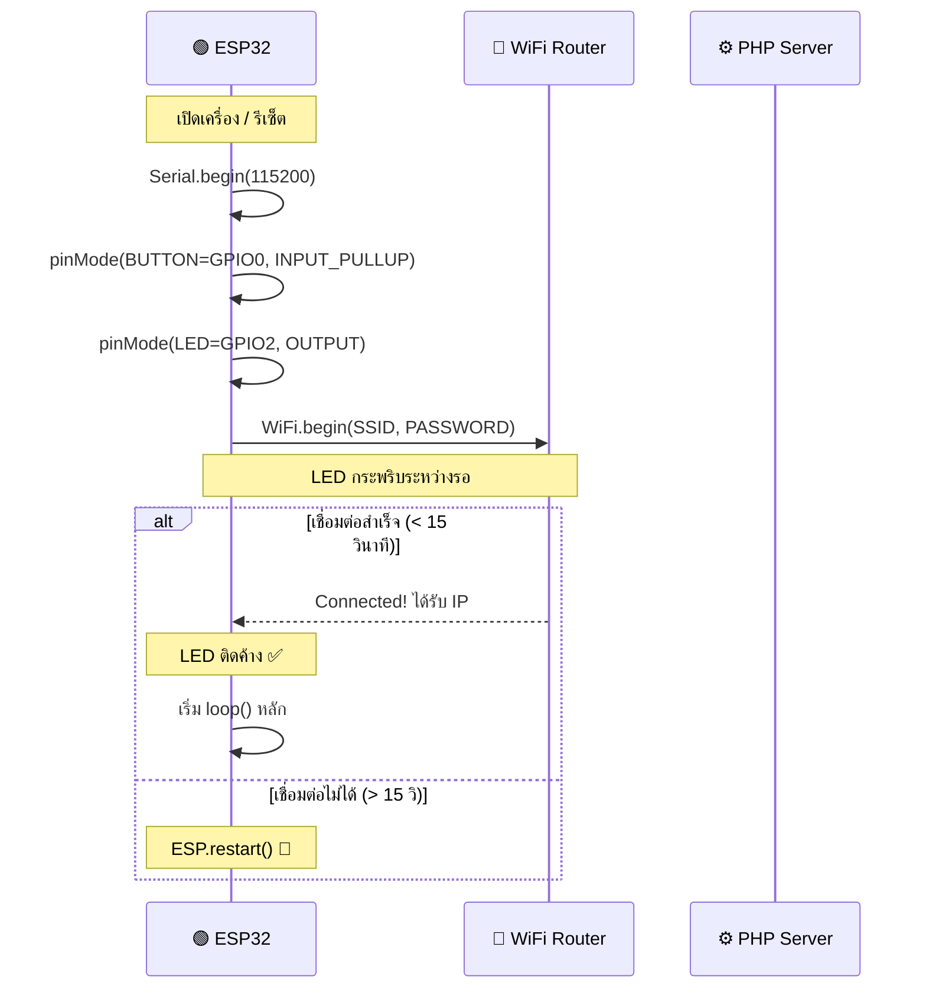

### 2️⃣ Heartbeat — ตรวจสอบสถานะต่อเนื่อง

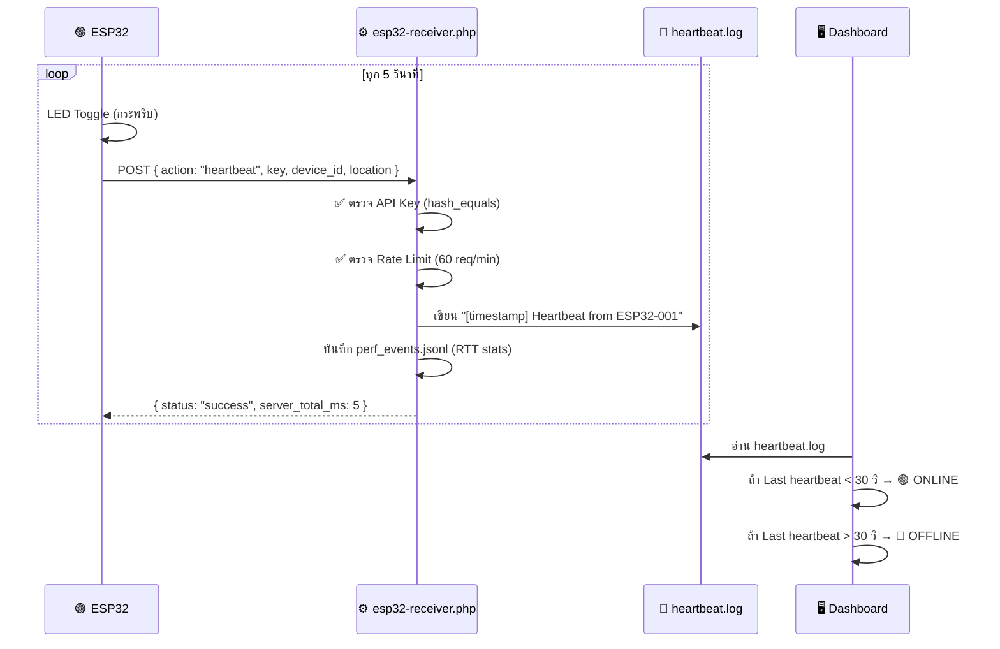

> [!NOTE]
> ระบบใช้ **ไฟล์ Log** แทน Database เพื่อให้ Write Latency ต่ำที่สุด (ไม่ต้อง Connection overhead ของ MySQL) เหมาะสำหรับระบบฉุกเฉินที่ต้องการความเร็ว

### 3️⃣ Emergency Alert — เมื่อกดปุ่มขอความช่วยเหลือ

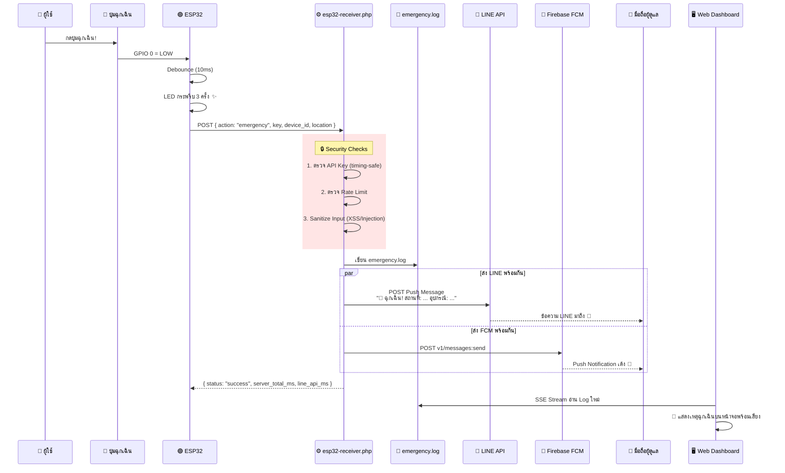

> [!IMPORTANT]
> เมื่อเกิด Emergency ระบบจะแจ้ง **3 ช่องทางพร้อมกัน**: LINE ข้อความ, FCM Push Notification, และ Web Dashboard (SSE Live Feed) เพื่อให้มั่นใจว่าผู้ดูแลจะได้รับแจ้งเสมอ

### 4️⃣ Performance Test — โหมดทดสอบความเร็ว

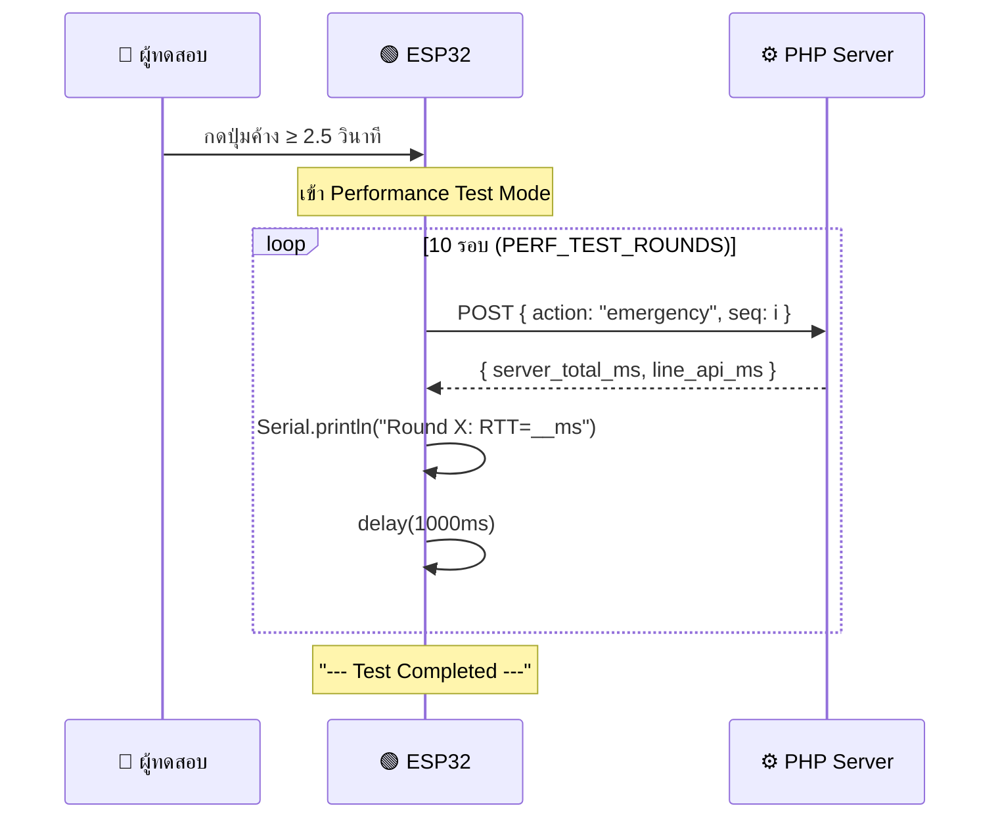

> [!TIP]
> เปิดโหมดทดสอบได้โดยตั้ง `PERF_TEST_MODE = true` ใน Firmware แล้วกดปุ่มค้าง 2.5 วินาที ระบบจะยิง 10 รอบติดต่อกันและวัด Round-Trip Time (RTT) ของแต่ละรอบ

---

## 🔐 ระบบ Security (ความปลอดภัย)

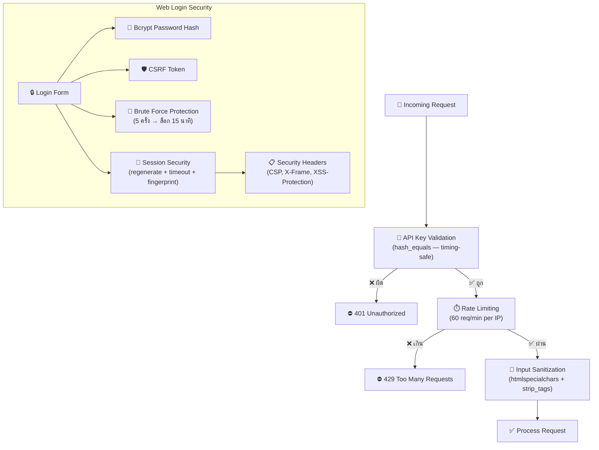

| มาตรการ | รายละเอียด |
|---------|-----------|
| **API Key** | ใช้ `hash_equals()` (Timing-safe comparison) กัน Timing Attack |
| **Rate Limiting** | จำกัด 60 requests/นาที ต่อ IP (File-based counter) |
| **Password** | Bcrypt hash (PASSWORD_DEFAULT) ไม่เก็บ Plain text |
| **CSRF** | Token-based, หมดอายุใน 10 นาที |
| **Brute Force** | ล็อกหลังผิด 5 ครั้ง → รอ 15 นาที |
| **Session** | Regenerate ID, Timeout 30 นาที, Browser Fingerprint |
| **Headers** | X-Frame-Options: DENY, CSP, XSS-Protection, Nosniff |
| **Input** | `htmlspecialchars()` + `strip_tags()` ทุก Input |
| **Google OAuth** | Whitelist email เท่านั้นที่เข้าได้ |

---

## 🌐 หน้าเว็บ Dashboard ทั้งหมด

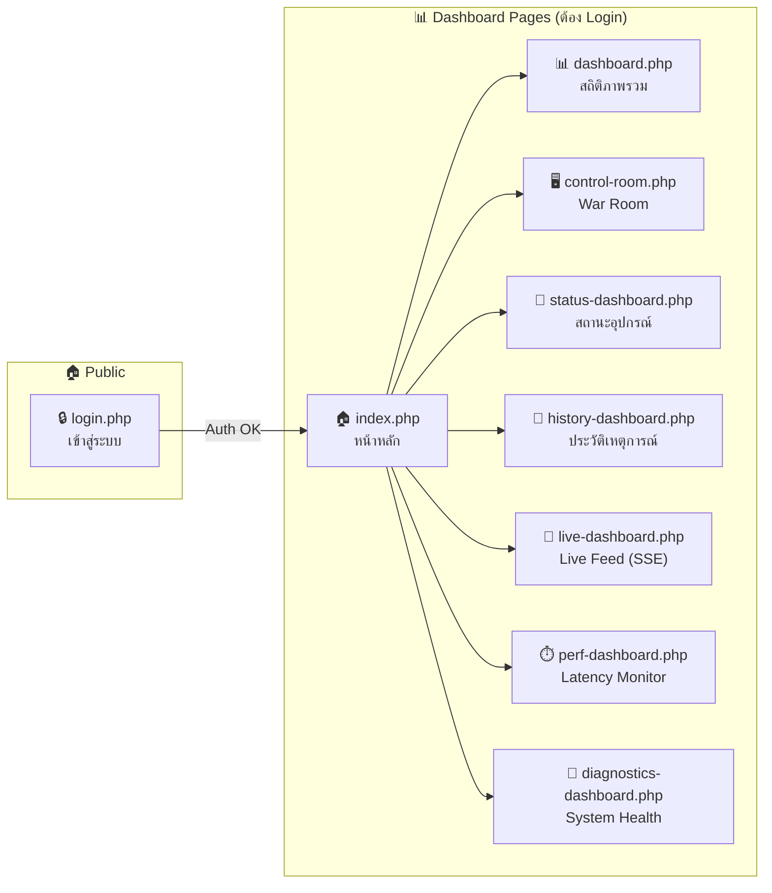

| หน้า | URL | คำอธิบาย |
|------|-----|---------|
| 🔒 Login | `/login.php` | เข้าสู่ระบบ (Admin/Google OAuth) |
| 🏠 Home | `/index.php` | หน้าหลัก + Quick Actions |
| 📊 Dashboard | `/dashboard.php` | สถิติ, กราฟ, Uptime, จำนวน Events |
| 🖥️ Control Room | `/control-room.php` | ศูนย์บัญชาการรวมข้อมูลทั้งหมด |
| 📡 Device Status | `/status-dashboard.php` | สถานะ ONLINE/OFFLINE ของทุกอุปกรณ์ |
| 🧾 History | `/history-dashboard.php` | ประวัติเหตุการณ์ฉุกเฉินทั้งหมด |
| 🔴 Live Feed | `/live-dashboard.php` | Real-time SSE Stream ดูเหตุการณ์สด |
| ⏱️ Latency | `/perf-dashboard.php` | วัด Performance และ Response Time |
| 🧪 Diagnostics | `/diagnostics-dashboard.php` | ตรวจสุขภาพระบบ (DNS/TLS/FS/Config) |

---

## 📡 ESP32 Firmware — สรุปการตั้งค่า

ไฟล์: [firmware/esp32_resqtech.ino](file:///c:/laragon/www/firmware/esp32_resqtech.ino)

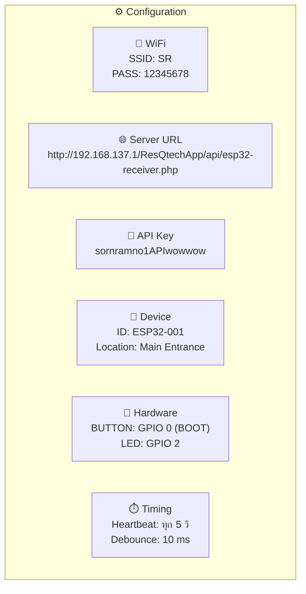

### GPIO Pinout

| Pin | ชื่อ | ทิศทาง | หน้าที่ |
|-----|------|--------|--------|
| GPIO 0 | BUTTON_PIN | INPUT_PULLUP | ปุ่ม BOOT (กดเพื่อแจ้งฉุกเฉิน) |
| GPIO 2 | LED_PIN | OUTPUT | แสดงสถานะ WiFi / Heartbeat / Emergency |

### พฤติกรรม LED

| สถานะ | พฤติกรรม LED |
|-------|------------|
| กำลังเชื่อมต่อ WiFi | กระพริบถี่ (ทุก 0.5 วิ) |
| เชื่อมต่อ WiFi สำเร็จ | ติดค้าง |
| Heartbeat ส่งออก | Toggle สั้นๆ 1 ครั้ง |
| กดปุ่มฉุกเฉิน | กระพริบ 3 ครั้ง → ติดค้าง → ดับ |

---

## 🔄 Data Flow Summary (สรุปการไหลของข้อมูล)

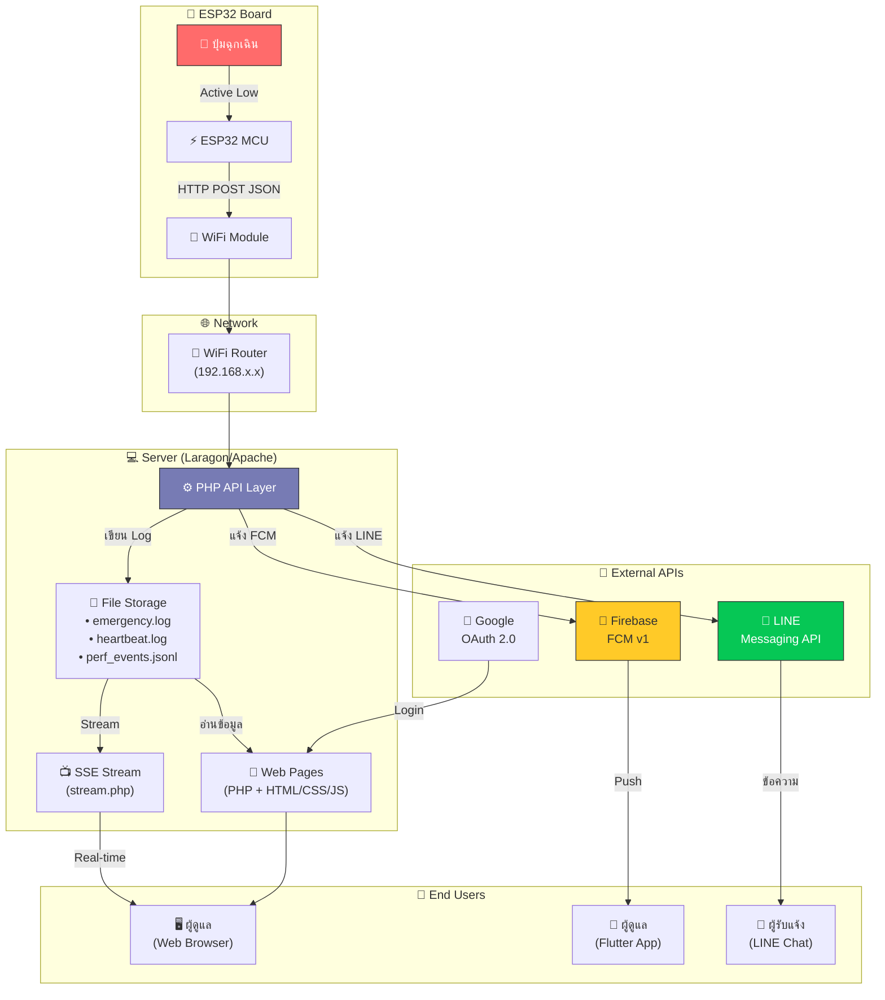

---

## ⏱️ Performance Characteristics (ลักษณะด้าน Performance)

| Metric | ค่า | หมายเหตุ |
|--------|-----|---------|
| **Heartbeat Interval** | 5 วินาที | ESP32 ส่งทุก 5 วิ |
| **Online Threshold** | 30 วินาที | หาก heartbeat ล่ากว่า 30 วิ → OFFLINE |
| **Server Process (Heartbeat)** | ~5 ms | เขียน Log อย่างเดียว |
| **Server Process (Emergency)** | ~250 ms | รวม LINE API + FCM API |
| **Rate Limit** | 60 req/min/IP | ป้องกัน Spam |
| **Log Rotation** | 5 MB / file | หมุนไฟล์อัตโนมัติ เก็บ 5 backup |
| **Session Timeout** | 30 นาที | สำหรับ Web Login |
| **WiFi Reconnect Timeout** | 15 วินาที | ถ้าไม่ได้ → ESP32 restart ตัวเอง |

---

## 🗺️ API Endpoints

````carousel
### 📡 ESP32 Receiver API
```
POST /api/esp32-receiver.php
```
**รับได้ 2 actions:**
- `heartbeat` → บันทึกสถานะ, คืน `server_total_ms`
- `emergency` → แจ้ง LINE + FCM + บันทึก Log

**Security:** API Key + Rate Limit + Input Sanitization
<!-- slide -->
### 📺 SSE Real-time Stream
```
GET /api/stream.php
```
ส่งข้อมูล Event ใหม่แบบ Server-Sent Events
ใช้โดย Live Dashboard เพื่ออัปเดตหน้าจอแบบ Real-time

<!-- slide -->
### 📋 History API
```
GET /api/get-history.php
```
ดึงประวัติเหตุการณ์ฉุกเฉินจาก `emergency.log`
ใช้โดย History Dashboard + Flutter App

<!-- slide -->
### 📡 Device Status API
```
GET /api/check-status.php
```
ตรวจสอบสถานะ Online/Offline ของ ESP32
คำนวณจาก Last Heartbeat Timestamp

<!-- slide -->
### 📱 Mobile Login API
```
POST /api/mobile-login.php
```
สำหรับ Flutter App เข้าสู่ระบบ
คืน `session_id` ใช้เป็น Bearer Token

<!-- slide -->
### 🔔 FCM Token Registration
```
POST /api/register-fcm-token.php
```
ลงทะเบียน FCM Token ของมือถือ
เพื่อรับ Push Notification เมื่อเกิดเหตุ

<!-- slide -->
### ⏱️ Performance Report
```
GET /api/perf-report.php
```
ดึงข้อมูล Latency จาก `perf_events.jsonl`
ใช้โดย Latency Monitor Dashboard

<!-- slide -->
### 🧪 Connection Diagnostics
```
GET /api/connection-diagnostics.php
```
ตรวจสุขภาพระบบ: DNS, TLS, Filesystem, Config
ใช้โดย Diagnostics Dashboard
````

---

## 🏗️ Application Bootstrap Flow

ลำดับการโหลดเมื่อมีคนเปิดหน้าเว็บ:

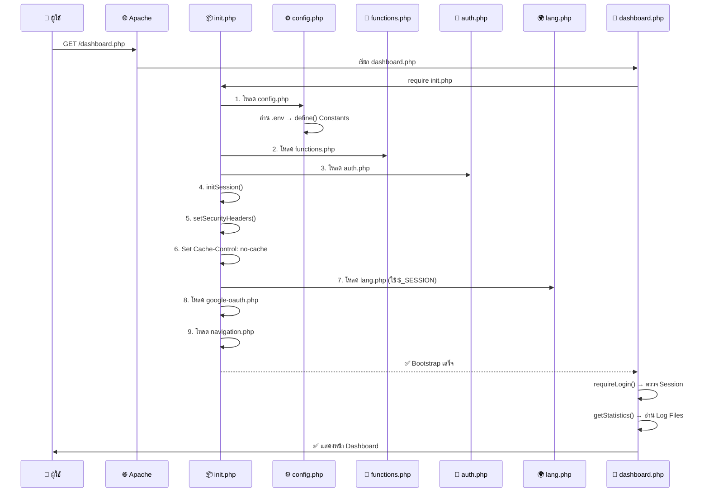

---

> [!CAUTION]
> **ข้อมูลลับ (Secrets) ทั้งหมด** เก็บอยู่ในไฟล์ `.env` ซึ่งถูก `.gitignore` ไว้ไม่ให้ขึ้น Git ระวังอย่า commit ไฟล์นี้ขึ้น Public Repository!

---

## 📝 สรุป

ResQTech เป็นระบบ **Full-Stack IoT Emergency System** ที่ครอบคลุมตั้งแต่:

1. **🔧 ฮาร์ดแวร์** (ESP32 + Button + LED)
2. **⚙️ Backend** (PHP API + File-based Storage)
3. **🎨 Frontend** (Neo-Brutalism Web Dashboard + PWA)
4. **📱 Mobile** (Flutter App + FCM Push)
5. **📢 Notifications** (LINE + FCM + SSE)
6. **🔐 Security** (API Key, Rate Limit, CSRF, Bcrypt, Session, CSP)

ทั้งหมดออกแบบมาเพื่อให้ **Latency ต่ำที่สุด** และ **เชื่อถือได้สูงสุด** ในสถานการณ์ฉุกเฉิน 🚨
